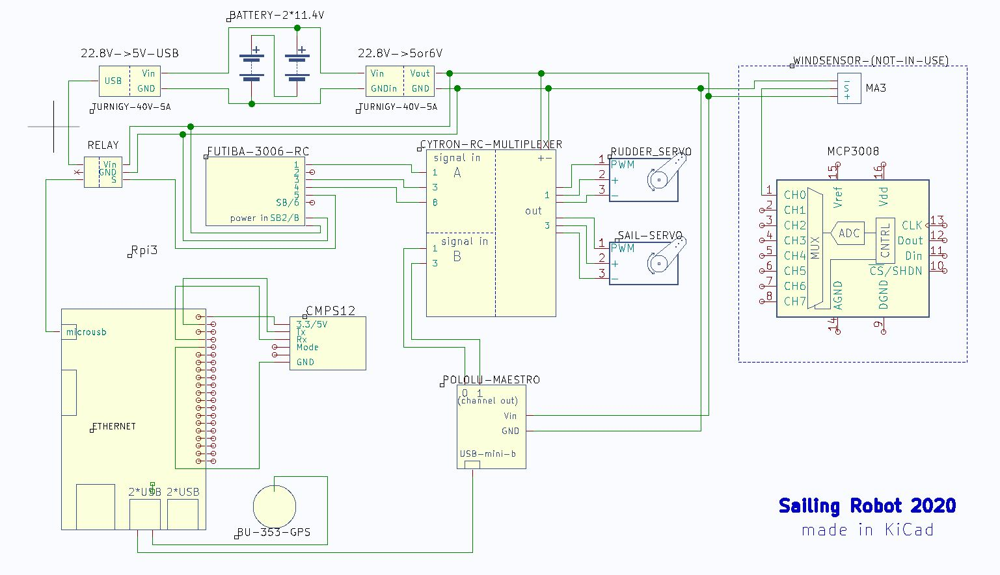

# SailingBoat
Project application for the "Programkonstruktion och projekthantering"
(also known as the PoP kurs) course at Åland Polytechnic.

## Components

- PC - Raspberry Pi 3 WiFi
- Boat - RC Laser
- Receiver - Futaba
- Controller - Futaba
- Switch - RC Switch
- Servo Controller - Maestro
- Servo - Futuba
- Relay - Omron
- GPS - GlobalSat
- Compass - CMPS12
- Wind-sensor - MA3
- Converter - Turnigy 40V 5A
- Batteries - Turnigy 11V 500mAh

## Diagram
Hardware scheme [this link](https://github.com/SilverSailors/SailingBoat/blob/master/doc_hardware/scheme_hardware.JPG)

## Installation
Either use Archlinux ARM(which is default for this course), or use Raspbian,
but if Raspbian is used, then some things might not be done the same way.

Follow the [Arch Linux ARM download and installation
guide](https://archlinuxarm.org/platforms/armv8/broadcom/raspberry-pi-3) for Arch.

## Post-Installation
The application requires some libraries in order to compile, they can be named
differently depending on the system you install the packages from, however this
is what they are called for Archlinux atleast.

### Install packages:
- [i2c-tools](https://www.archlinux.org/packages/community/x86_64/i2c-tools/)
- [WiringPi](https://github.com/WiringPi/WiringPi)
- [gpsd](https://www.archlinux.org/packages/community/x86_64/gpsd/)

Edit the file *boot/cmdline.txt* and remove entries with*ttyAMA0(ex. console=ttyAMA0,115200)*.

Edit the file *boot/config.txt*
- Uncomment the line *device_tree_param=i2c_arm=on*.
- Uncomment the line *device_tree_param=i2s=on*.
- Uncomment the line *device_tree_param=spi=on*.

Edit the file */etc/modules-load.d/raspberrypi.conf*.
- Add line *i2c-bcm2708*.
- Add line *i2c-dev*.

Edit the file */etc/hostname*.

- Change text to *sailbot*.

For more information about devices on the raspberry pi go to: [this link](https://archlinuxarm.org/wiki/Raspberry_Pi)

## Code Procedure

1. Determine destination (Latitude, Longitude)
2. Check wind to determine best angle of approach (AOA)
3. Select angle and set a waypoint (in meters)
4. Each update cycle, compare our current bearing vector and adjust the
   waypoint, adjust bearing as neccesary.
5. repeat step 2-4.

## License
This is free software, licensed under [MIT](LICENSE).
